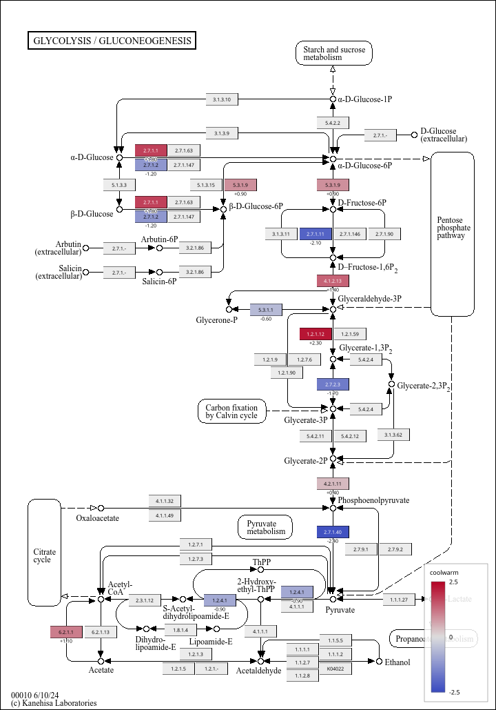

# kegg-map-kit

Colour KEGG pathway maps from a table of KEGG Ontology (KO) identifiers and
render the result as SVG. A scriptable, SVG-producing counterpart to the
[KEGG Mapper](https://www.genome.jp/kegg/mapper/) Color tool.

Zero runtime dependencies — Python 3.10+ and the standard library.

## Example

Glycolysis (`ko00010`) coloured from twelve values. Each box carries its EC
number redrawn on top of an opaque fill, so the caption stays legible at any
colour; the value is printed beneath; KO boxes with no data are grey; and the
colorbar is pinned to a fixed range so separate maps stay comparable.

    kegg-map-kit ko00010 -i examples/demo.tsv -o glycolysis.svg \
        --cmap coolwarm --vmin -2.5 --vmax 2.5 \
        --box-labels ec --unmapped-color '#ececec' --label-values

The numbers in [`examples/demo.tsv`](examples/demo.tsv) are synthetic.
[`examples/glycolysis_vector.svg`](examples/glycolysis_vector.svg) is the same
data through `--mode vector`: no bitmap at all, so it rasterises losslessly at
any resolution, at the cost of KEGG's arrows and decorations.

## Install

    uv tool install kegg-map-kit
    # or
    pip install kegg-map-kit

## Use

    kegg-map-kit ko00010 -i data.tsv -o map.svg

`data.tsv` holds a KO identifier per line, followed by either colours or numbers:

    K00844	#ff0000
    K01810	blue
    K00845	#00ff00,#000000

The third line uses KEGG Mapper's `bg,fg` syntax: the second colour sets the
box's label colour in `--mode vector`. Fields may be separated by tabs, commas
or spaces, so a file written for KEGG Mapper works unchanged. Only whole lines
beginning with `#` are treated as comments; there are no trailing comments.

or values, which are mapped through a colormap and get a legend:

    K00844	2.0	1.4
    K01810	-1.5	-0.2

Several columns, or several KOs sharing one box, split that box into vertical
slices (up to 12).

## Options

| Flag | Default | Meaning |
| --- | --- | --- |
| `--mode raster\|vector` | `raster` | `raster` embeds KEGG's map PNG and paints on top; `vector` redraws boxes from KGML alone |
| `--cmap NAME` | `coolwarm` | `coolwarm`, `RdBu`, `viridis`, `Reds`, `Blues` |
| `--vmin` / `--vmax` | auto | Colour scale bounds. Diverging maps auto-scale symmetrically |
| `--opacity` | `0.75` | Overlay opacity in raster mode |
| `--offline` | off | Use the cache only, never the network |
| `--cache DIR` | `$XDG_CACHE_HOME/kegg-map-kit`, else `~/.cache/kegg-map-kit` | Cache location |
| `--kgml` / `--png` | — | Use local files instead of fetching |
| `--na-color COLOR` | — | Fill for blank cells; blank cells are skipped by default |
| `--unmapped-color COLOR` | — | Fill for KO boxes the input has no data for. Boxes carrying no KO at all (compounds, links to other maps) are left as KEGG drew them |
| `--box-labels ko\|symbol\|ec` | — | Repaint each box's caption on top of the fill, so an opaque colour stays readable. `ec` reproduces the string KEGG itself prints in the box. Implies `--opacity 1.0` |
| `--box-label-color`, `--box-label-size` | auto, `7` | Box label colour (default: auto black/white by fill darkness) and font size |
| `--blend normal\|multiply` | `normal` | `multiply` keeps KEGG's own captions legible under a translucent fill |
| `--label-values` | off | Print each value beneath its box. Value input only |
| `--label-size` | `7` | Font size for `--label-values` |
| `--no-legend`, `--no-links` | — | Suppress the colorbar / the links to KEGG |
| `-q` | off | Suppress the summary line |

Coloured boxes carry hover text and link to their KEGG entry page.

KEGG data is cached indefinitely under `--cache`; delete that directory to
refresh.

## Exit codes

| Code | Meaning |
| --- | --- |
| `0` | Success |
| `1` | User error — bad pathway id, unusable command line, malformed input table, unknown colormap, `--png` with `--mode vector`, offline cache miss, KEGG 404, corrupt map image |
| `2` | Network failure with no usable cache |

Exit 2 means the network, and only the network, so a script can retry on 2 and
give up on 1.

## Scope

v0.1.0 handles KO-level maps (`ko#####`) and colours `rectangle` entries only.
Compounds, organism-specific gene IDs, and the line-based global maps such as
`ko01100` are not coloured.

## Licence

MIT. KEGG data is © Kanehisa Laboratories and is subject to the
[KEGG terms of use](https://www.kegg.jp/kegg/legal.html); this tool only
retrieves and renders it.
